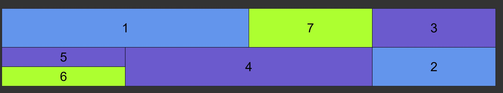

# grid-task

This is example of the structure which I created to learn basic skills related to grid.

* [General info](#general-info)
* [Technologies](#technologies)
* [Screenshots](#screenshots)
* [Setup](#setup)
* [Inspiration](#inspiration)

## General info
I made this project to practice my skills related to grid.

## Technologies
Project is created with:
* HTML5
* CSS3

## Screenshots

## Setup
You can see this project on-line using link: 
To run this project locally download the code and run in the Visual Studio Code program. 

## Inspiration
Project based on MMCSchool course 'Kurs Tworzenia Stron WWW cz. 3' 
